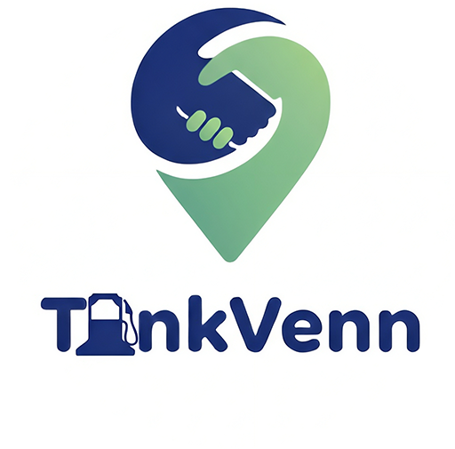
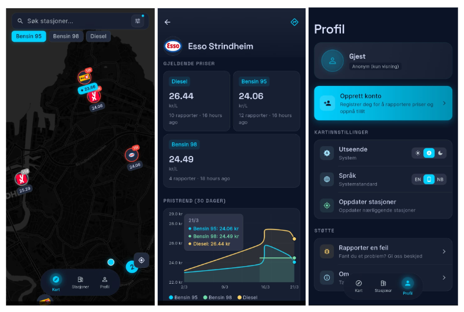

# TankVenn

<p align="center">
  
</p>

En open-source, fellesskapsbasert app for å finne billigst drivstoff i nærheten.

An open-source, community-driven app to find the cheapest fuel nearby.

---

<p align="center">
  
</p>

## Norsk

### Hva er TankVenn?

TankVenn er et hobbyprosjekt som lar brukere finne og dele drivstoffpriser i sitt område. Appen er bygget på prinsippet om at en app som er avhengig av fellesskapet, burde eies av fellesskapet. Ingen paywall, ingen premium, ingen planer om det.

### Funksjoner

- **Drivstoffpriser i nærheten** — Se hvor det er billigst å fylle i ditt område.
- **OCR-støtte** — Ta bilde av prisskiltet, beskjær og last opp. Prisene fylles ut automatisk.
- **Metadata-analyse** — Last opp bilder senere fra hjemmet. Appen leser bildets metadata for å knytte det til riktig stasjon (innenfor 1 km radius).
- **Offentlig database** — Stasjons- og prisinformasjon eksporteres til et offentlig depot hver 12. time: [tankvenn/data](https://tsotnek.github.io/tankvenn/data/index.html)

### Kostnader og drift

Appen har to gjentagende kostnader:

| Tjeneste | Kostnad (100 000 daglige brukere) |
|---|---|
| Firestore backend | ~21$/mnd |
| OCR via Haiku 4.5 | ~2$/mnd |
| **Totalt** | **~25$/mnd** |

TankVenn er non-profit. Målet er at driftskostnader dekkes av frivillige donasjoner.

### Tech stack

- **Frontend:** Flutter (Dart) med Material 3
- **Backend:** Firebase (Firestore, Auth)
- **Kart:** `flutter_map` + `latlong2` (OpenStreetMap)
- **OCR:** Claude Haiku 4.5 (begrenset til 256 output tokens)
- **Typisk bruk per bruker per dag:** ~12 reads

### Installasjon

#### Android
Last ned den nyeste .apk fra [releases](https://github.com/tsotnek/tankvenn/releases).

#### Google Play Store
Under publisering — trenger 12 testere for å oppfylle Googles krav.

#### App Store
Ikke tilgjengelig enda. Trenger hjelp med Apple developer konto og publisering.

### Bidra

TankVenn trenger frivillige bidragsytere! Spesielt folk med erfaring innen backend og mobilutvikling. Målet er at jeg selv bare er en bruker, ikke eieren — appen tilhører fellesskapet.

Sjekk issues, åpne en PR, eller bli med på [Discord](link).

#### Husk å formatere koden

CI-pipelinen kjører et **Check formatting**-steg på alle PRer. Det feiler hvis koden ikke er formatert. Kjør `dart format .` før du åpner en PR.

### Lisens

Open-source — se [LICENSE](LICENSE) for detaljer.

## Licensing

**The Source Code is licensed under GPL-3.0 and the Crowdsourced Database is licensed under ODbL-1.0.**

### Note on Relicensing

Versions of this project prior to March 2026 remain available under the MIT License in the Git history.

## Data Contributions

By submitting fuel prices to TankVenn, you agree to share that data under the **ODbL (Open Database License) 1.0 — Share-Alike** terms. This ensures the Norwegian fuel market remains transparent and the crowdsourced database stays open and accessible to everyone.

---

## English

### What is TankVenn?

TankVenn is a hobby project that lets users find and share fuel prices in their area. The app is built on the principle that an app that depends on the community should be owned by the community. No paywall, no premium, no plans for it.

### Features

- **Nearby fuel prices** — See where it's cheapest to fill up in your area.
- **OCR support** — Take a photo of the price sign, crop and upload. Prices are filled in automatically.
- **Metadata analysis** — Upload photos later from home. The app reads the image metadata to link it to the correct station (within 1 km radius).
- **Public database** — Station and price data is exported to a public repository every 12 hours: [tankvenn/data](https://tsotnek.github.io/tankvenn/data/index.html)

### Costs and operations

The app has two recurring costs:

| Service | Cost (100,000 daily users) |
|---|---|
| Firestore backend | ~$21/month |
| OCR via Haiku 4.5 | ~$2/month |
| **Total** | **~$25/month** |

TankVenn is non-profit. The goal is for operating costs to be covered by voluntary donations.

### Tech stack

- **Frontend:** Flutter (Dart) with Material 3
- **Backend:** Firebase (Firestore, Auth)
- **Maps:** `flutter_map` + `latlong2` (OpenStreetMap)
- **OCR:** Claude Haiku 4.5 (limited to 256 output tokens)
- **Typical usage per user per day:** ~12 reads

### Installation

#### Android
Download latest .apk from [releases](https://github.com/tsotnek/tankvenn/releases).

#### Google Play Store
Publishing in progress — needs 12 testers to meet Google's requirements.

#### App Store
Not available yet. Need help with Apple developer account and publishing.

### Getting started (development)

1. **Clone the repository**
    ```bash
    git clone https://github.com/tsotnek/tankvenn.git
    cd tankvenn
    ```

2. **Install dependencies**
    ```bash
    flutter pub get
    ```

3. **Configure Firebase**
    ```bash
    flutterfire configure
    ```

4. **Run the app**
    ```bash
    flutter run
    ```

### Contributing

TankVenn needs volunteer contributors! Especially people with experience in backend and mobile development. The goal is that I'm just a user, not the owner — the app belongs to the community.

Check issues, open a PR, or join the [Discord](link).

#### Remember to format your code

The CI pipeline runs a **Check formatting** step on all PRs. It will fail if the code is not formatted. Run `dart format .` before opening a PR.

### License

Open-source — see [LICENSE](LICENSE) for details.

## Licensing

**The Source Code is licensed under GPL-3.0 and the Crowdsourced Database is licensed under ODbL-1.0.**

### Note on Relicensing

Versions of this project prior to March 2026 remain available under the MIT License in the Git history.

## Data Contributions

By submitting fuel prices to TankVenn, you agree to share that data under the **ODbL (Open Database License) 1.0 — Share-Alike** terms. This ensures the Norwegian fuel market remains transparent and the crowdsourced database stays open and accessible to everyone.
